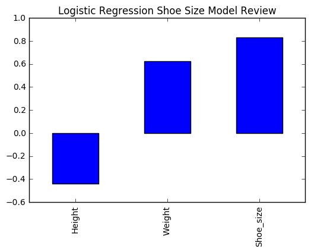
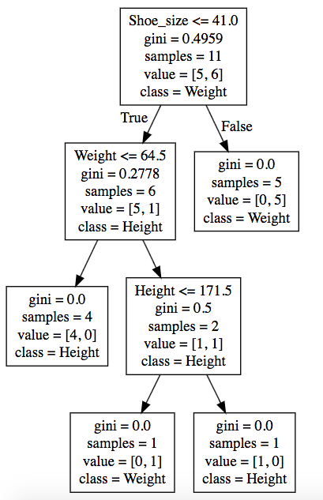

# Basic Machine Learning - Notebook 1

This notebook provides an overview of three basic machine learning models as well as basic data munging. A special focus is given to understanding and interpreting model results. More advanced concepts such as bifurcating data between training and testing sets, model scoring, optimization etc, will be covered in Notebooks 2+.


```python
# Import libraries
import pandas as pd # pandas is used for manipulating data 
from sklearn.linear_model import LogisticRegression # Sklearn is a machine learning library
from sklearn import tree 
from sklearn import svm
# allow plots to be seen in this notebook
% matplotlib inline 
```


```python
#import excel data
ShoeData = pd.read_excel('SampleMLData.xlsx',sheetname = 'Train')
```


```python
# review data
ShoeData.head()
```


<div>
<table border="1" class="dataframe">
  <thead>
    <tr style="text-align: right;">
      <th></th>
      <th>Height</th>
      <th>Weight</th>
      <th>Shoe_size</th>
      <th>Classification</th>
      <th>Unnamed: 4</th>
    </tr>
  </thead>
  <tbody>
    <tr>
      <th>0</th>
      <td>181</td>
      <td>80</td>
      <td>44</td>
      <td>male</td>
      <td>NaN</td>
    </tr>
    <tr>
      <th>1</th>
      <td>177</td>
      <td>70</td>
      <td>43</td>
      <td>male</td>
      <td>NaN</td>
    </tr>
    <tr>
      <th>2</th>
      <td>160</td>
      <td>60</td>
      <td>38</td>
      <td>female</td>
      <td></td>
    </tr>
    <tr>
      <th>3</th>
      <td>154</td>
      <td>54</td>
      <td>37</td>
      <td>female</td>
      <td>NaN</td>
    </tr>
    <tr>
      <th>4</th>
      <td>166</td>
      <td>65</td>
      <td>40</td>
      <td>male</td>
      <td>NaN</td>
    </tr>
  </tbody>
</table>
</div>


```python
# Remove uneeded column
del ShoeData['Unnamed: 4']
```


```python
# Assign the 'answer' to the Y variable
Y = ShoeData['Classification'].values

# Now, remove the 'answer' column from the ShoeData 
del ShoeData['Classification']
```


```python
# The 'answer' data is now in an array
Y
```


    array([u'male', u'male', u'female', u'female', u'male', u'male', u'female',
           u'female', u'female', u'male', u'male'], dtype=object)


```python
# Assign the rest of the values to the X variable array
X = ShoeData.values 
```


```python
# Array of heights, weights and shoe sizes
X
```


    array([[181,  80,  44],
           [177,  70,  43],
           [160,  60,  38],
           [154,  54,  37],
           [166,  65,  40],
           [190,  90,  47],
           [175,  64,  39],
           [177,  70,  40],
           [159,  55,  37],
           [171,  75,  42],
           [181,  85,  43]])


## Machine learning models

* Logistic Regression
* Decision Tree
* Support Vector Machine

## Logistic Regression

Logistic regression was created by David Cox in 1958 (https://www.jstor.org/stable/2983890) and is a regression model where the response variable is a binary "0,1" classification, such as Fraud/NotFraud, Sick/NotSick.  


```python
# Instantiate logistic regression model
clf = LogisticRegression()
```


```python
# Fit the logistic regression model to the X and Y data 
clf.fit(X, Y)

# Now, make a prediction using by putting in Height, Weight and Shoe size  variables
predictionLog = clf.predict([[190, 70, 43]])

print '''The prediction of a heigh of 190 cm, a weight of 70 kg 
and a shoe size of 43 yields a classification as a: %s''' % predictionLog
```

    The prediction of a heigh of 190 cm, a weight of 70 kg 
    and a shoe size of 43 yields a classification as a: [u'female']


```python
# Now, we want to interpret the model to see why a given prediction was made

# We assign the coefficients of the model and and the feature names to a pandas series object, 
# essentially a variable, called weights
weights = pd.Series(clf.coef_[0],
                    index=ShoeData.columns)

# View the output of weights 
print weights
```

    Height      -0.439204
    Weight       0.622762
    Shoe_size    0.829036
    dtype: float64


```python
# To help visualize the results, we will plot the weights. We can see that shoe size is the variable, 'feature', 
# that is weighted the most
weights.plot(kind='bar',title = 'Logistic Regression Shoe Size Model Review')
```


    <matplotlib.axes._subplots.AxesSubplot at 0x1186a03d0>





## Decision Tree

A Decision Tree, in machine learning, is a classifier that creates a path to an outcome based on several input variables. Each "leaf" represents an output given teh specific input variable values. Decision Trees are arguably one of most comprehensible models in machine learning and when combined in massive "forests",  can be a very effective algorithm.  


```python
# Instantiate Decision Tree model
TreeClf = tree.DecisionTreeClassifier()
```


```python
# Fit the decision tree model to the X and Y data 
TreeClf.fit(X, Y)

# Now, make a prediction using by putting in Height, Weight and Shoe size  variables
predictionTree = TreeClf.predict([[190, 70, 43]])

print '''The prediction of a heigh of 190 cm, a weight of 70 kg 
and a shoe size of 43 yields a classification as a: %s''' % predictionTree
```

    The prediction of a heigh of 190 cm, a weight of 70 kg 
    and a shoe size of 43 yields a classification as a: [u'male']


```python
# Now, we will construct a decision tree showing how the model comes to conclusions. The decision tree is 
# outputed to a file called 'tree.dot' which is turned into an image at http://www.webgraphviz.com/. The website was found
# courtesy of StackOverFlow, http://stackoverflow.com/questions/1494492/graphviz-how-to-go-from-dot-to-a-graph
dot_data = tree.export_graphviz(TreeClf, feature_names=ShoeData.columns,  class_names = ShoeData.columns,
                          out_file='tree.dot') 
```

A screenshot was taken of the tree and can be seen below:




## Support Vector Machines

One of the more complicated machine learning models, aside from deep learning, which is a topic for another time, Support Vector Machines essentially draw a line, which does not have to be linear(straight), in-between classes to maximize the space between. The imaginary "support lines" that touch the closest classes are called the "support vectors", and the imaginary three lines, the support vectors and the bisecting line are called a hyperplane. The hyperplane is always drawn in one less dimension than the number of variables, so n-1, which along with the crazy math that accompany this algorithm, make it difficult to conceptuialize.   


"Maximum-margin hyperplane and margins for an SVM trained with samples from two classes. Samples on the margin are called the support vectors" https://en.wikipedia.org/wiki/Support_vector_machine#/media/File:Svm_max_sep_hyperplane_with_margin.png


```python
# Instantiate Support Vector model
svm_clf = svm.SVC()
```


```python
# Fit the decision tree model to the X and Y data 
svm_clf.fit(X, Y)

# Now, make a prediction using by putting in Height, Weight and Shoe size  variables
predictionSVM = svm_clf.predict([[190, 70, 43]])

print '''The prediction of a heigh of 190 cm, a weight of 70 kg 
and a shoe size of 43 yields a classification as a: %s''' % predictionSVM
```

    The prediction of a heigh of 190 cm, a weight of 70 kg 
    and a shoe size of 43 yields a classification as a: [u'male']


```python
# Now we begin to run into the problem of interpretability, being able to explain why a given prediction was made. 
# For nonlinear, non-monotonic functions, such as support vector machines, we cannot, currently, explain exactly why
# a given prediciton was made. It is an area of current research however. 

# look at the support vectors
print(svm_clf.support_vectors_.shape)
print(svm_clf.support_.shape)
print(svm_clf.n_support_ )
```

    (11, 3)
    (11,)
    [5 6]


# Conclusion

This was a rough and tumble introduction to three common machine learning algorithms. Stay tuned for more notebooks and feel free to send me a note at brassatc@icloud.com if you have any questions or comments. 

Thanks! -Andrew
